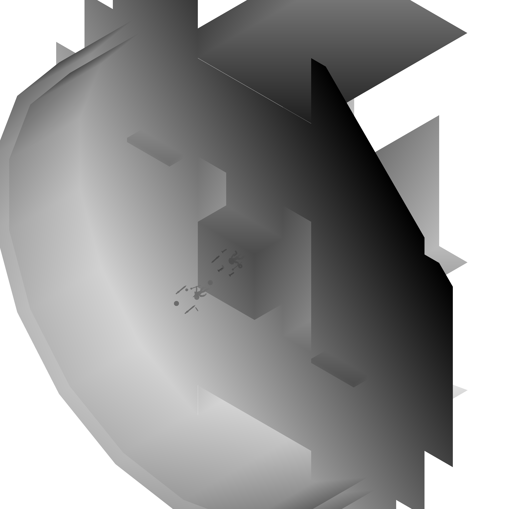

# **磁界之王**
### 河原電子ビジネス専門学校
### ゲームクリエイター科2年　錦織隼王

# **目次**
### 1. [作品概要](#overview)
### 2. [操作説明](#operation)
### 3. [TODO:担当ソースコード](#responsible)
### 4. [TODO:改造したエンジンのコード](#enginecode)
### 5. [画面分割](#splitview)
### 6. [ブルーム](#bloom)
### 7. [デプスシャドウ](#shadow)
### 8. [カプセルコライダー](#capsule)
### 9. [弾の発射先の決定](#bullet)
### 10. [リングゲージ](#ringgauge)

# **1. 作品概要**
* ## 磁界之王(じかいのおう)
    三人称視点の二人対戦シューティングゲームで、  
    各プレイヤーにかかる磁力を考えた攻撃・行動をしながら  
    もう一人のプレイヤーを倒すゲームです。
    <iframe width="640" height="360" src="https://www.youtube.com/embed/7DGJrvtbmGc" title="YouTube video player" frameborder="0" allow="accelerometer; autoplay; clipboard-write; encrypted-media; gyroscope; picture-in-picture" allowfullscreen></iframe>  

    **紹介動画**
* ## 使用ゲームエンジン
    学校内製エンジンを改造して使用
* ## 使用ツール
    Visual Studio 2019  
    Visual Studio Code  
    3ds Max 2021  
    Adobe Photoshop Elements 2020  
    Git
* ## 使用言語
    C++  
    HLSL
* ## 開発環境
    Windows10  
    DirectX12
* ## 制作人数
    4人
* ## 開発期間
    2021年2月～現在

# **2. 操作説明**
   

# **3. TODO:担当ソースコード**
○○.cpp  
□□.cpp  
△△.cpp(一部)  

# **4. TODO:改造したエンジンのコード**
* GameObjectManagerクラス  
ポストエフェクトやシャドウの描画  
画面分割の描画に対応
* △△△△～～

# **5. 画面分割**
    

2人のプレイヤーがそれぞれの視点を持つため、2つの画面が必要ですが、  
複数のVIEWPORTを用意することで画面分割を実装しています。  
分割せず画面全体に表示したいスプライト等のため、  
画面全体を覆うVIEWPORTも用意し、そちらでスプライト等の描画を行っています。  

# **6. ブルーム**
川瀬式ブルームを実装。  
通常シーンをオフスクリーンレンダリング後、輝度が高いピクセルを抽出し、  
ブラーとダウンサンプリングをかけながら複数枚のテクスチャを作成し、  
複数枚のテクスチャの平均を取って加算合成しています。  
  
**通常シーン**  
  
**輝度抽出したテクスチャ**  
  
**ブラーをかけながらダウンサンプリングしたテクスチャ**  
**(さらにダウンサンプリングしながら複数枚作成)**  
  
**加算合成後**  

# **7. デプスシャドウ**
平行光源によるデプスシャドウを実装しています。  
ライトの座標から影を落とすオブジェクトまでの深度値と  
ライトの座標から影が落ちるか判定するピクセルまでの深度値を比較し、  
影を落とすオブジェクトまでの深度値の方が短かった時に影が落ちます。  
平行光源のため、深度値にはライトカメラからの距離ではなく、  
カメラ空間のXY平面からの最短距離を計算して使用しています。  
  
**通常の光源での深度値の計算**  
  
**平行光源での深度値の計算**  
  
**作成されたシャドウマップ**    

# **8. カプセルコライダー**
プレイヤーと弾との当たり判定のため、カプセルコライダーを作成し、使用しています。  
移動処理によって移動する前の弾の座標と、移動した後の弾の座標を  
カプセルの端点にすることで、スピードの速い弾でもプレイヤーをすり抜けることなく  
判定する事ができます。  
  

# **9. 弾の発射先の決定**
三人称視点のゲームのため、どうしても照準で狙う方向とプレイヤーが弾を発射する方向が  
ずれてしまいます。
そこで、カメラから照準の方向にレイを飛ばし、  
最初にレイがステージのモデルに当たった座標に向かって弾を発射するようにしています。

  

しかし、これだけでは相手プレイヤーを狙ったとしてもその奥にあるステージを狙う事になり、  
相手プレイヤーに向かって弾を飛ばす事が困難です。

  

そこで、各プレイヤーに常に相手のプレイヤー方向を向く平面の当たり判定を用意し、  
そこに照準の方向へのレイが交差した場合も交差地点に弾を発射するようにしました。  
  
**プレイヤーの向きに関係なく常に相手方向に向く**
  

# **10. リングゲージ**
プレイヤーの磁力の状態を表すゲージとして、8の字の形のゲージを用意しています。  
  
内積を利用して描画ピクセルの角度を計算し、指定した角度以上なら描画する  
といったリングゲージを作成し、それを2つ並べて配置することで  
8の字に減少するようにしました。  
  
  